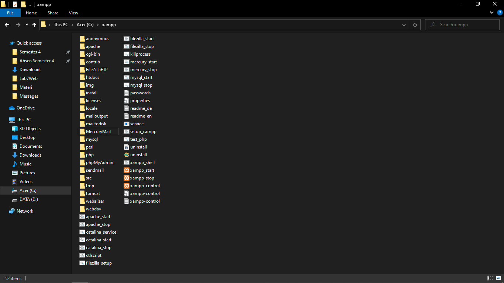
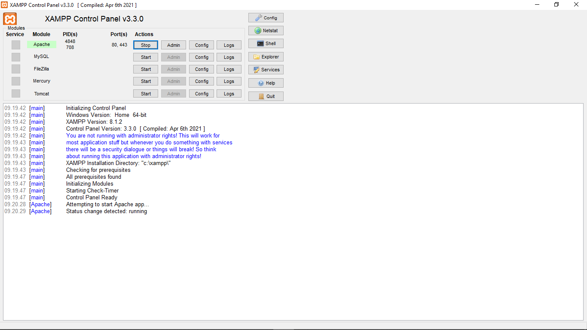
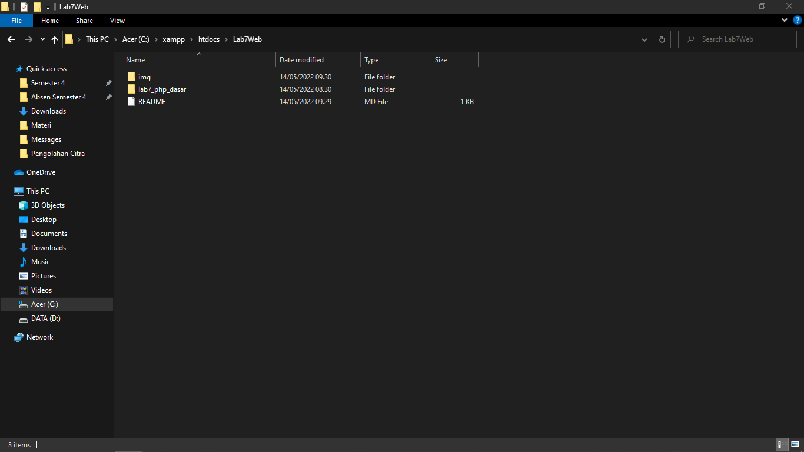
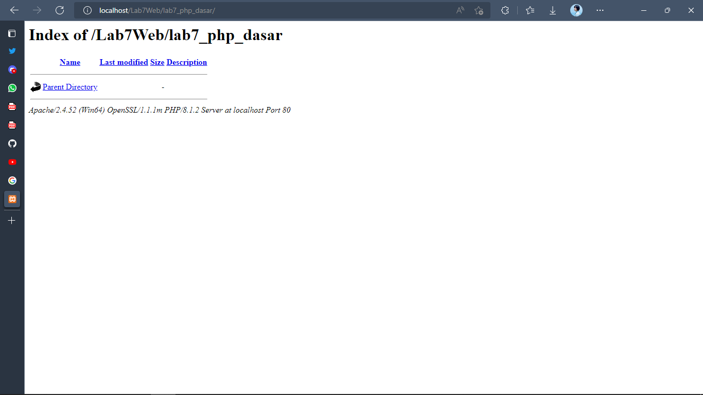
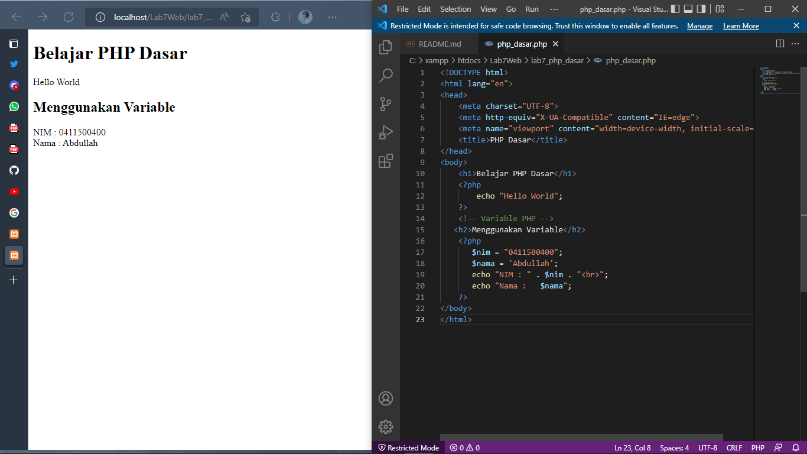
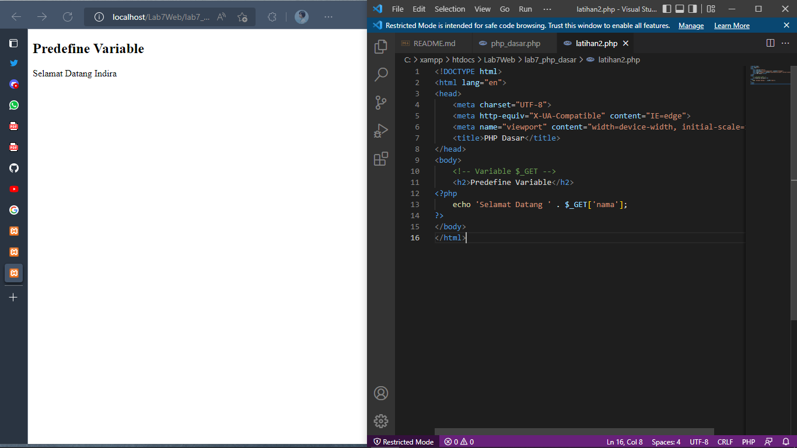
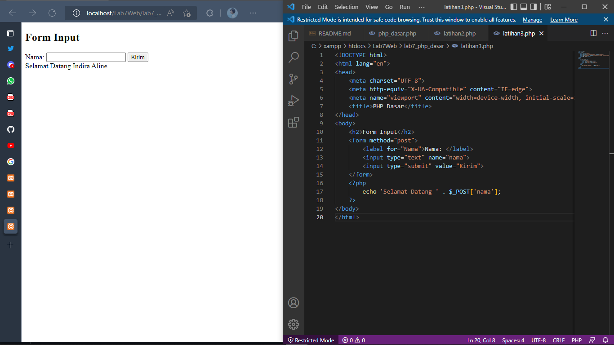
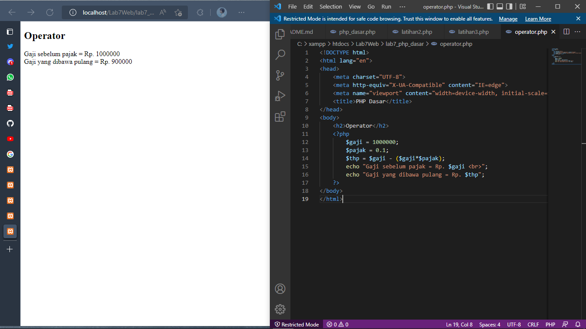
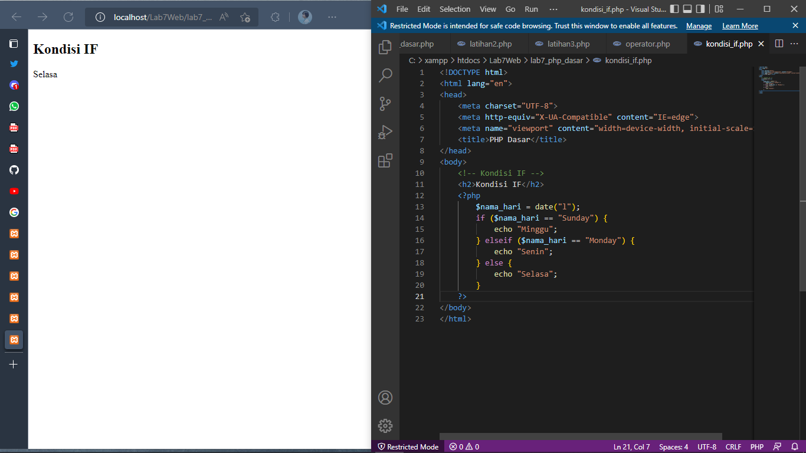
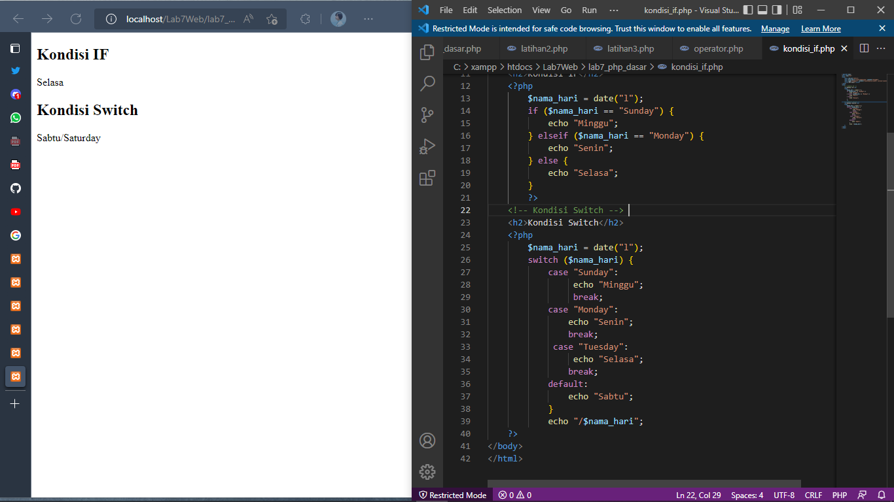

# Lab7Web

|   INDIRA ALINE       |    312010042       |
| ---------------------|--------------------|
|  TI.20.A.1           | PEMROGRAMAN WEB    |
|  PERTEMUAN 9         | PRAKTIKUM 7        |

Di pertemuan ini akan mempelajari **PHP DASAR** dengan beberapa program code ***PHP*** nya.

## PHP DASAR

## LANGAKAH-LANGKAH PRAKTIKUM

## 1). INSTALL XAMPP UNTUK SERVER 



**PENJELASAN**

Install **XAMPP** untuk ***WEB SERVER*** dan kemudian ekstrak file nya dan sesuaikan dimana Anda menyimpan file tersebut.

## 2). MENJALANKAN WEB SERVER



**PENJELASAN**

Mengaktifkan **XAMPP** dengan menekan tombol  **START SERVER APACHE** Seperti gambar di atas.


## 3). MEMULAI PHP 

Buat folder lab7_php_dasar pada root directory web server (c:xampp\htdocs)



**PENJELASAN**

Di atas saya membuat folder ***lab7_php_dasar*** yang dimana folder itu disimpan dalam folder **Lab7Web** untuk repository. Kemudian akses directory pada web server dengan mengakses URL : http://localhost/Lab7Web/lab7_php_dasar/



**PENJELASAN**

Di atas adalah contoh dari tampilan dalam URl atau tampilan server folder tersebut.


## 4). PHP DASAR
Buat file baru dengan nama **php_dasar.php** pada directory tersebut kemudian buat kode seperti berikut.


**PENJELASAN** 

Kemudian akses URL untuk hasil nya : http://localhost/Lab7Web/lab7_php_dasar/php_dasar.php

Di atas adalah contoh hasil dari penggunaan **PHP** dalam file html atau **embed**

**code php**
```php
<!DOCTYPE html>
<html lang="en">
<head>
    <meta charset="UTF-8">
    <meta http-equiv="X-UA-Compatible" content="IE=edge">
    <meta name="viewport" content="width=device-width, initial-scale=1.0">
    <title>PHP Dasar</title>
</head>
<body>
    <h1>Belajar PHP Dasar</h1>
    <?php
        echo "Hello World";
    ?>
</body>
</html>
```


## 5). VARIABLE PHP

Menambahkan Variable pada program.



**PENJELASAN**

Di atas adalah contoh penggunaan Variable di **PHP**

**code php**
```php
<h2>Menggunakan Variable</h2>
    <?php
       $nim = "0411500400";
       $nama = 'Abdullah';
       echo "NIM : " . $nim . "<br>";
       echo "Nama : $nama"; 
    ?>
```

## 6). PREDEFINE VARIABLE $_GET

Menggunakan **Predefine Variable**



**PENJELASAN**

Buat file baru dalam directory **lab7_php_dasar** dengan nama file nya adalah **latihan2.php** dan buat code seperti dibawah dan untuk mengaksesnya gunakan URL: http://localhost/Lab7Web/lab7_php_dasar/latihan2.php?nama=Indira
dan tampilan nya seperti gambar diatas.

**code php**
```php
<!DOCTYPE html>
<html lang="en">
<head>
    <meta charset="UTF-8">
    <meta http-equiv="X-UA-Compatible" content="IE=edge">
    <meta name="viewport" content="width=device-width, initial-scale=1.0">
    <title>PHP Dasar</title>
</head>
<body>
    <!-- Variable $_GET -->
    <h2>Predefine Variable</h2>
<?php
    echo 'Selamat Datang ' . $_GET['nama'];
?> 
</body>
</html>
```

## 7). MEMBUAT FORM INPUT



**PENJELASAN**

Buat file baru dengan nama **latihan3.php** dalam directory folder **lab7_php_dasar**  di atas adalah hasil atau tampilan dalam membuat ***form*** dalam php dengan variable $_POST contoh code seperti dibawah.

**code php**
```php
<!DOCTYPE html>
<html lang="en">
<head>
    <meta charset="UTF-8">
    <meta http-equiv="X-UA-Compatible" content="IE=edge">
    <meta name="viewport" content="width=device-width, initial-scale=1.0">
    <title>PHP Dasar</title>
</head>
<body>
    <h2>Form Input</h2>
    <form method="post">
        <label for="Nama">Nama: </label>
        <input type="text" name="nama">
        <input type="submit" value="Kirim">
    </form>
    <?php
        echo 'Selamat Datang ' . $_POST['nama'];
    ?>
</body>
</html>
```

## 8). OPERATOR 



**PENJELASAN**

Membuat ***OPERATOR*** dalam php seperti contoh hasil tampilan di atas beserta code nya.

**code php**
```php
    <?php
        $gaji = 1000000;
        $pajak = 0.1;
        $thp = $gaji - ($gaji*$pajak);
        echo "Gaji sebelum pajak = Rp. $gaji <br>";
        echo "Gaji yang dibawa pulang = Rp. $thp";
    ?>
```

## 9). KONDISI IF



**PENJELASAN**

Pengondisian **IF ELSE** seperti hasil tampilan dan code pada gambar atas.

**code php**
```php
    <?php
        $nama_hari = date("l");
        if ($nama_hari == "Sunday") {
            echo "Minggu";
        } elseif ($nama_hari == "Monday") {
            echo "Senin";
        } else {
            echo "Selasa";
        }
    ?>
```

## 10). KONDISI SWITCH



**PENJELASAN**

Contoh penggunaan pengondisian **SWICTH CASE** dengan ***Break*** seperti contoh hasil di atas beserta code.

**code php**
```php
<?php
        $nama_hari = date("l");
        switch ($nama_hari) {
            case "Sunday":
                 echo "Minggu";
                 break;
            case "Monday":
                echo "Senin";
                break;
             case "Tuesday":
                 echo "Selasa";
                break;
            default:
                echo "Sabtu"; 
            }
            echo "/$nama_hari";
    ?>
```